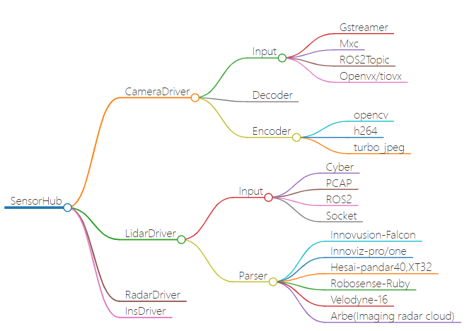
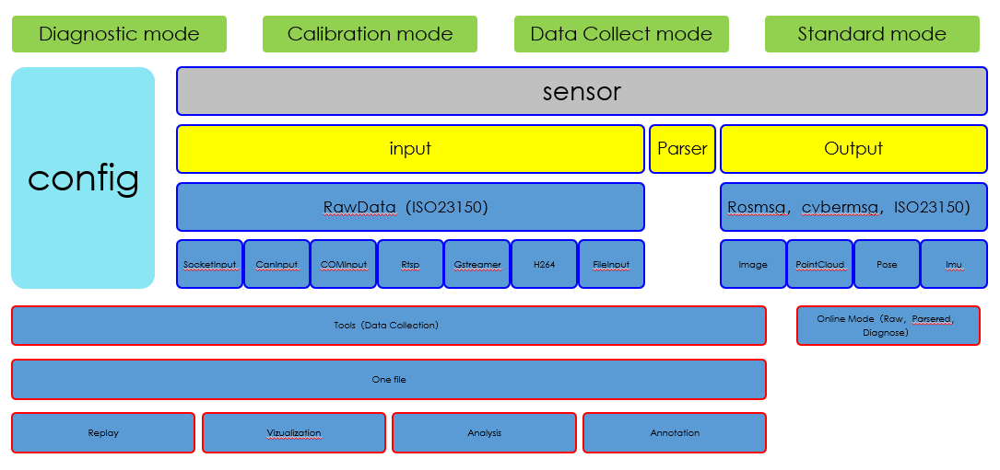

# SENSOR_HUB

## Description

* This project is named `sensor_hub` which could be used for sensor app layer.



## High Light
* Each time we create or start a new robotics platform, selecting the appropriate sensors is always our first task. Unfortunately, third-party sensor software lacks standardization. Sometimes, performance regarding latency is inadequate. Other times, we need to add new functionalities such as diagnostics, data collection, data replay, sensor calibration, etc. The structure of the sensor hub project offers a new approach to address these issues.

* It can adapt to different types of sensor inputs, including Ethernet, CAN, GStreamer, and files (PCAP, Cyberbag, ROSbag). You can use this versatile structure to explore and tailor it for your specific needs.

* Implement all the needs and it allows you to execute different kinds of sensor group during the runtime by the configuration.

* [some other details in chinese](docs/docs_zh.pdf)



## 1. Build

### dependencies

``` shell
# turbojpeg and opencv used in camera driver, c++ 17 used like <filesystem>
apt install libopencv-dev libopencv-contrib-dev libturbo-jpeg-dev libturbojpeg libturbojpeg0-dev libjpeg-turbo8-dev g++-8
```

* [cyber](https://github.com/FengD/apollo_cyber)


* Set env for different platform
`export PLATFORM=X86`  `export TAG=1804`(CYBER)  `export TAG=AFRED`(ROS) for X86

`./build.sh` build the project.
`./build.sh clean` clean the build.
run `./build.sh help` to see the details.

### 1.1. help menu
./build.sh help

```
Usage:
    ./build.sh [OPTION]

Options:
    all: run the code style check
    build: run the code build
    clean: clean the code build
    cov: run the code test coverage
    check_code [param]: check code qulity param 'help' for check_code param list
```


### 1.2. CodeCheck
* use `./build.sh check_code run` first to verify if all check passed!

### 1.3. Coverage check
``` shell
function gen_coverage() {
  cd ${WS}
  rm -rf cov
  mkdir -p cov
  lcov -d ./build -z
  cd build
  ctest
  cd ${WS}
  lcov -d ./build -b modules --no-external --rc lcov_branch_coverage=1  -c -o cov/raw_coverage.info
  lcov -r cov/raw_coverage.info "*test*" -o cov/drivers.info --rc lcov_branch_coverage=1 'build/*'
}
```

## Release
* If the build successed, all the release are in the `build_dist` folder.

## EXECUTE

``` shell
export MAIN_WS=
execute_camera_drivers.sh
execute_lidar_drivers.sh
execute_radar_drivers.sh
execute_imu_drivers.sh

```
